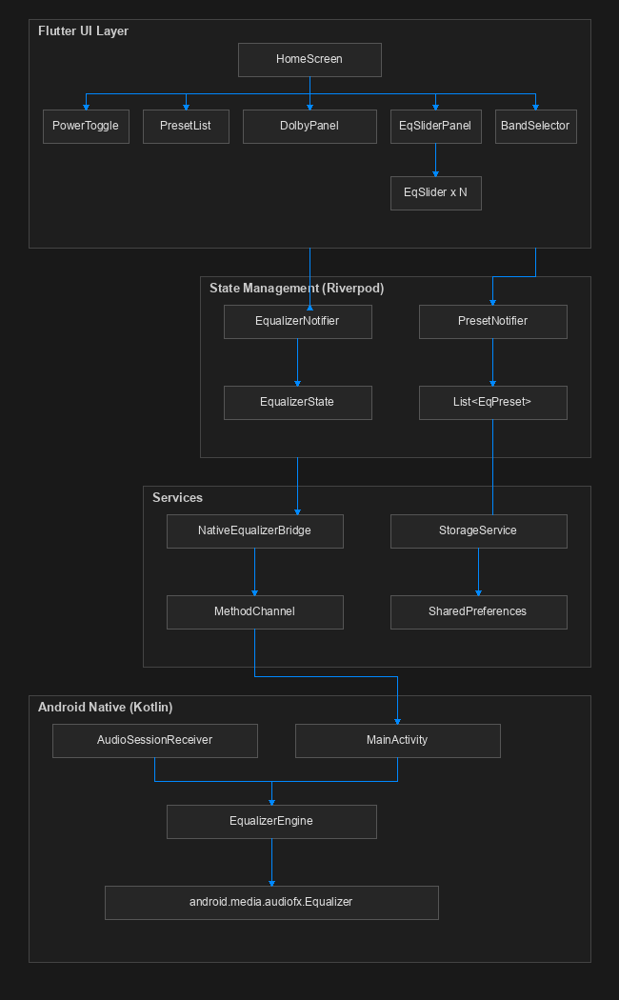

# EQron

System Wide Audio Equalizer and Sound Enhancer for Android

EQron is an advanced audio processing application engineered to deliver system wide equalizer controls, sound enhancement effects, and dynamic cross band preset management across Android devices. Built using Flutter for a sleek cyberpunk inspired user interface and native Kotlin for high performance low latency audio engine execution, EQron provides fine tuned frequency manipulation for 3, 5, 7, 10, and 15 band configurations.

## System Architecture



### 1. Presentation Layer (Flutter UI)

* HomeScreen: Main container managing responsive layout switching between Portrait and Landscape modes.
* EqSliderPanel: Main equalizer interface hosting frequency band sliders. In Portrait mode, sliders adapt dynamically to screen width. In Landscape mode, sliders occupy maximum horizontal width.
* EqSlider: Touch drag thumb control with plus or minus 1.0 dB precision adjustment buttons. Tap on track is disabled to prevent accidental gain jumps.
* DolbyEnhancerPanel: Interactive controls for Bass Boost, 3D Spatial Virtualizer, and Loudness Clarity. Adapts into a compact inline bar in Landscape mode and a full control card in Portrait mode.
* BandSelector: Mode switcher allowing users to toggle between 3, 5, 7, 10, and 15 band equalizer configurations.
* PresetList: Renders built in and custom saved presets. Supports cross band preset selection with log frequency gain interpolation.

### 2. State Management and Bridge Layer (Dart Riverpod and MethodChannel)

* EqualizerProvider: Central Riverpod StateNotifier managing power state, band count, band gain levels, Dolby effect parameters, and application orientation preferences.
* FrequencyUtils: Utility class containing frequency maps for all band modes (3, 5, 7, 10, and 15 bands) and weighted log frequency interpolation functions. When switching band counts, current gain curves are interpolated smoothly without resetting active presets.
* NativeEqualizerBridge: MethodChannel wrapper routing asynchronous calls between Dart and native Kotlin engine via channel com.EQron/equalizer.
* StorageService: SharedPreferences manager persisting application state and custom user presets as JSON objects.

### 3. Native Audio Engine Layer (Android Kotlin)

* EqualizerEngine: Core audio manager wrapping android.media.audiofx.Equalizer. Features a precalculated log frequency weight cache matrix (cachedWeights) to achieve zero latency high frame rate gain curve updates without runtime floating point recalculation overhead.
* AudioSessionReceiver: BroadcastReceiver listening for system wide audio session events (ACTION_OPEN_AUDIO_EFFECT_CONTROL_SESSION and ACTION_CLOSE_AUDIO_EFFECT_CONTROL_SESSION) to automatically attach equalizer instances to active media players.
* MainActivity: FlutterActivity managing MethodChannel invocations and lifecycle management for native audio effects.
* Sound Enhancer Suite: Native management of android.media.audiofx.BassBoost, android.media.audiofx.Virtualizer, and android.media.audiofx.LoudnessEnhancer.

## Key Features

1. System Wide Equalization: Attaches to Android global audio output session 0 as well as specific media player audio sessions.
2. Universal Cross Band Preset Interpolation: Presets created in any band mode can be applied seamlessly to 3, 5, 7, 10, or 15 band modes using weighted log frequency distance calculations.
3. Sound Enhancer Suite: Integrated Bass Boost (0 to 100%), 3D Spatial Virtualizer (0 to 100%), and Loudness Clarity (0 to +10.0 dB).
4. Drag Only Slider Safety: Accidental taps on slider tracks are ignored; gains adjust only when dragging slider thumbs or tapping step buttons.
5. Responsive Layouts: Dual panel side by side dock in Landscape mode and full height adaptive sliders in Portrait mode.
6. Orientation Lock: Internal orientation control allowing users to lock app orientation in Portrait, Landscape, or follow system Auto Rotate.

## Building and Running

### Prerequisites

* Flutter SDK version 3.6.0 or higher
* Android SDK API level 28 or higher (Android 9.0+)
* Java Development Kit 11

### Build Release APK

To build a release APK for Android target architecture:

```bash
flutter build apk
```

The output APK binary will be located inside the build outputs directory.

## License

This project is open source and available under the MIT License.
